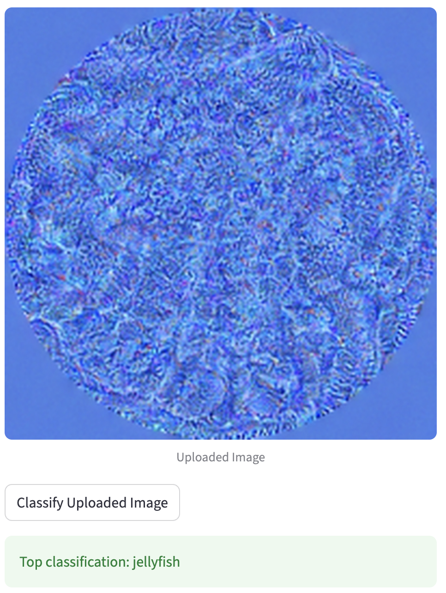
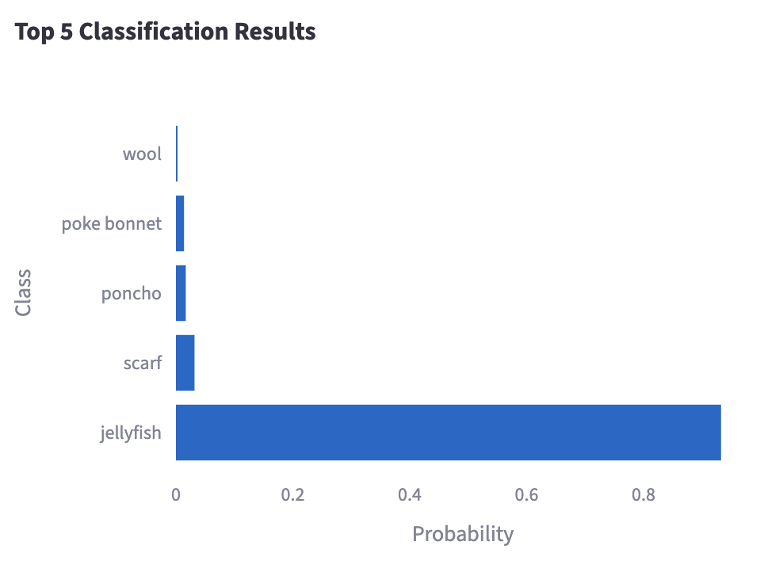

# AIPI 590 - XAI - Adversarial Patches - *Jellyfish*

This repository contains the Colab/Jupyter notebook and helper files used to create a physical adversarial patch that causes a pretrained ResNet34 (ImageNet) classifier to predict a chosen target class ("jellyfish"). The goal is to produce a printable sticker that reliably induces the target prediction on diverse backgrounds and photographed scenes.

## Contents

- `adversarial_attacks_patches.ipynb`: main notebook: data preparation, patch initialization, augmentation, optimization, evaluation, and export.
- `patch_outputs/`: saved patch snapshots, `best_patch.png`, `best_patch.pt`, printable images.
- `sample_images/`: background images used for training (populated by the notebook).
- `test_images/`: held-out images for evaluation (add your photos here).
- `README.md`: repository overview and instructions.

## Overview

The notebook follows a targeted adversarial patch approach: a small image patch is optimized so that, when overlaid onto arbitrary backgrounds and photographed, a ResNet34 model with ImageNet weights classifies the resulting scene as the chosen target label. The optimization uses randomized geometric and photometric augmentations and a total-variation regularizer to encourage smooth, printable patches.

## Requirements

The notebook was developed for Google Colab (GPU recommended) and requires the following Python packages:

- python >= 3.8
- torch, torchvision (latest stable)
- pillow
- numpy
- tqdm
- kornia

In Colab you can install requirements with the cell provided in the notebook. Locally, install via:

```bash
pip install torch torchvision pillow numpy tqdm kornia
```

## How to run (Colab)

1. Open `adversarial_attacks_patches.ipynb` in Google Colab.
2. Runtime → Change runtime type → Hardware accelerator → GPU.
3. Run the install / setup cell to install dependencies (if needed).
4. Run cells top-to-bottom. Key hyperparameters are near the start (PATCH_SIZE, LR, EPOCHS, TV_WEIGHT). If you use the default sample images the notebook will download them; otherwise, add images to `sample_images/` before running.
5. After training, the notebook writes printable outputs to `patch_outputs/` (single patch and sticker sheet) and saves the best patch tensor as `best_patch.pt`.

## File organization and where to put images

- `sample_images/` — background images used for training. The notebook will populate this from STL10 by default; you may replace or augment them with your own photos.
- `test_images/` — held-out test photos for final evaluation. Add any photographs you want to test the physical printed patch on (e.g., phone photos of scenes with the printed sticker).
- `patch_outputs/`: output files are written here by the notebook:
    - `patch_epoch_###.png` snapshots during training,
    - `best_patch.png` and `best_patch.pt` the best-performing patch,
    - `jellyfish_patch_print_600px.png` single-print image,
    - `jellyfish_patch_sticker_sheet_3x3.png` 3×3 sticker sheet.

## Printing the patch (physical testing)

1. Open `patch_outputs/jellyfish_patch_print_600px.png` (or the sticker sheet).
2. Print at 300 DPI on matte paper or sticker paper. Matte reduces glare in photos.
3. Cut out a single patch (or peel sticker) and place it on an object or scene you want to test.
4. Photograph the scene with your phone under typical classroom lighting and place the photo(s) into test_images/.
5. Re-run the evaluation cell in the notebook to see predictions and measured success rate.


## Example Result

The trained adversarial patch successfully causes the pretrained ResNet34 to classify the image as *“jellyfish”* with high confidence.

**Model output:**  





## Attribution and references

This implementation follows the adversarial patch approach popularized by Brown et al., “Adversarial patch” (2017). The pretrained ResNet34 model and ImageNet categories are provided by `torchvision.models`. Please cite the class project and the following sources as appropriate:

- Brown, T. B., et al., “Adversarial patch,” arXiv:1712.09665, 2017.
- Torchvision ResNet34 weights: torchvision models.